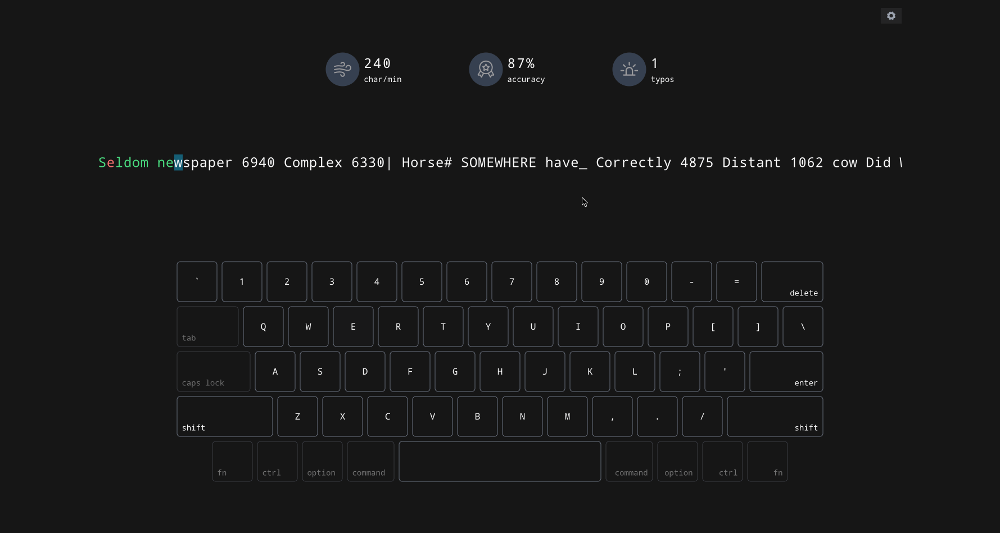

<h1>
  KeyType
</h1>

  一款简约的纯客户端打字练习软件，没有复杂繁琐的功能，仅在于练习打字

 

## 运行项目

本项目是基于`React`开发的，需要 node 环境来运行。

### 安装和运行

1. 安装 NodeJS，参考[官方文档](https://nodejs.org/en/download)
2. 克隆代码仓库，移动至项目根目录
3. 推荐使用 `pnpm install` 安装依赖
4. 运行 `pnpm run dev` 启动本地环境，浏览器会自动打开相应的窗口
